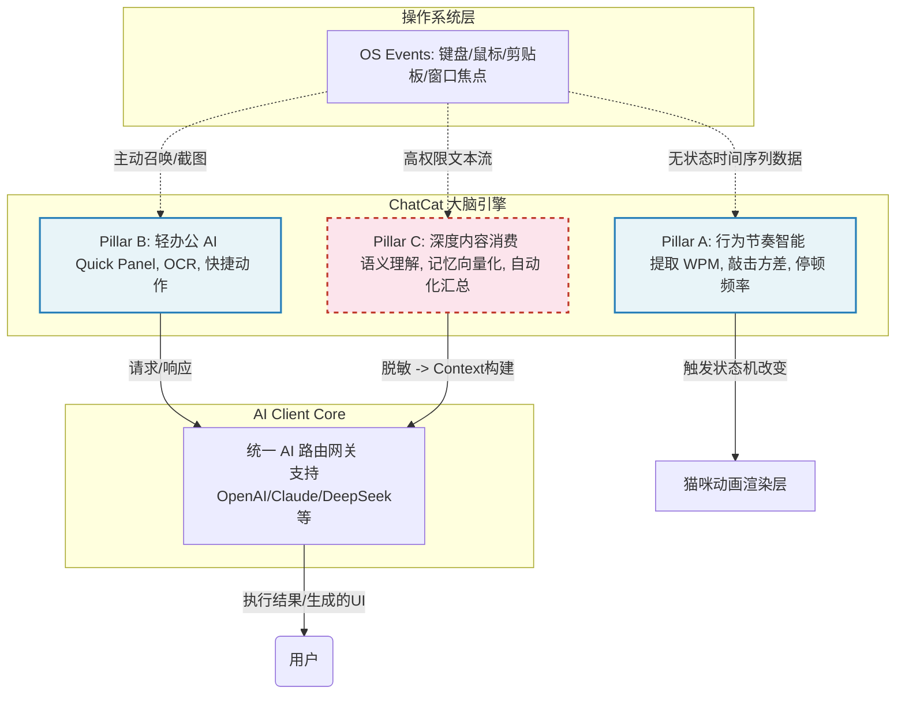

# 从玩具到大脑：一个人与一只猫的 Vibe Coding 实验

大家好。今天我想和大家聊聊我最近在做的一个非常有意思的 Side Project。

如果你关注最近 AI 圈子的进展，你会发现大家都处于一种极度兴奋的状态。无论是司内还是司外，大家都在谈论 Agent、谈论多模态、谈论如何用 AI 颠覆现有的工作流。特别是 Vibe Coding（直觉编程）的兴起，让"一人公司"、"超级个体"不仅成为了可能，甚至正在成为一种主流的软件开发范式。

但在这个过程中，我一直在思考一个第一性原理的问题：**人机交互的终极形态，真的是一个冷冰冰的 Chat 窗口吗？**

去年 Bongo Cat（敲键盘的猫）在全网爆火的时候，我盯着它看了很久。它极其简单，甚至可以说有些"蠢"，但它提供了一种无与伦比的**"即时情绪反馈"**。今年，当 OpenClaw 等桌面级智能体项目开始展现出强大的桌面控制能力时，我突然有了一个 Aha Moment：

**如果我们将 Bongo Cat 的"情绪价值"与现代大模型的"认知能力"结合，创造一个生活在你视线边缘、永远具备上下文感知（Context-aware）、但又绝不主动打扰你的桌面生物，会发生什么？**

这就是 ChatCat 诞生的起点。今天，我想以一种稍微深入一些、但尽量通俗的视角，带大家拆解这只猫背后的思考、架构，以及它走向未来的可能性。

---

## 1、产品定位：填补"效能"与"情感"的真空地带

在动手写第一行代码之前，我们需要看清楚当前桌面级软件的生态版图。如果你把现在的产品放在一个坐标系里，你会发现几个极端的聚类：

1. **纯效率工具（The Copilots）**：比如 Raycast、Cursor。它们极其强大，但它们是"被动触发"的。你需要知道自己想要什么，并且需要主动去召唤它们（Cmd+K）。它们没有温度。
2. **纯桌面宠物（The Pets）**：比如传统的 VPet、Shimeji。它们很可爱，能提供极高的情绪价值，但在 2026 年的今天，如果一个桌宠只能在屏幕上爬来爬去而不能帮你处理个 JSON，你会觉得它是在浪费你的内存。
3. **纯情感陪伴（The Companions）**：比如 Replika 或者 Character.ai。它们能聊天，但它们与你的真实工作流（你的代码、你的文档、你的剪贴板）是完全割裂的。

**ChatCat 瞄准的，正是这三者中间那块无人问津的真空地带。**

```
【留空配图：一张展示三角定位的象限图，ChatCat 位于 Tool, Pet, Companion 的正中心交汇处】
```

我给 ChatCat 设定了两个核心的 User Persona（用户画像），并为他们设计了完全不同的价值反馈闭环：

### 视角 A：作为一个"玩家"的诉求 —— 社交货币与多巴胺
不要忽视桌宠的"玩具"属性。玩家需要的是什么？是**独特性和炫耀感**。
- **机制**：通过日常互动积累好感度，触发特定的扭蛋/抽卡行为。
- **反馈**：抽到 SSR 级别的皮肤、触发了极低概率的隐藏动画（比如猫咪突然给你变个魔术）。当用户把这个截图发到群里说"快看我的猫今天怎么了"，这就是最顶级的社交货币。

### 视角 B：作为一个"社畜"的诉求 —— 认知卸载（Cognitive Offloading）
工作已经够累了，我不需要一个桌宠来教我怎么写复杂的微服务架构，更不需要在累得半死的时候还要去编排多个 Agent 来帮我干活。
- **机制**：主动、隐式地感知用户的痛点，处理那些"不难，但很烦"的琐事。
- **反馈**：不需要我写 Prompt。猫检测到我复制了一段报错日志，自动探出头问："需要帮你看看这段 Error 吗？"；或者每天下班前，默默把今天收集的关键动作整理成一份日报草稿递给我。

这是一种 **Calm Technology（平静技术）** 的理念：它平时就安静地趴在那里，只有在它的置信度（Confidence Score）足够高、确信能帮到你的时候，才会介入。

---

## 2、当前实现内容：猫的"神经网络"架构

为了实现上述的理念，这只猫不能只是一个简单的 Electron 壳子套一个 API。它需要一套感知系统和一套执行系统。

在目前的实现中，我将它的"神经网络"拆分成了三个相互独立但又高度协同的 Pillar（支柱）。大家可以看这张架构图：



让我们一层层剥开来看：

### Pillar A：行为节奏智能 (The Rhythm Engine)
这是最有趣、也是最具挑战性的一部分。如何做到"懂你"但不"偷窥"你？
我们放弃了对具体内容的抓取，转而提取**时间序列特征**。系统在底层监听键鼠事件，但只计算 WPM（每分钟字数）、敲击的方差、停顿的频率。
- *当你 WPM 极高且方差极小*：系统判定你进入了 **Flow State（心流状态）**。此时，猫会戴上耳机，所有的通知被强行静默（L0 级别），绝不打扰。
- *当你 WPM 骤降，且出现大量 Backspace（退格键）操作*：系统判定你可能遇到了 Bug 或是思路卡壳。此时，猫的动画会切换到"关切/疑惑"，甚至可能会轻轻弹个气泡："遇到难题了吗？要不要聊聊？"。
**这一层，完全没有内容采集，纯粹是物理节奏的 AI 推断。**

### Pillar B：轻办公 AI (The Quick Reflexes)
这是猫的"小扳手"。这是一个独立的 BrowserWindow（Quick Panel）。
很多时候我们需要的不是长篇大论的对话，而是即时处理。比如你遇到了一个无法复制的弹窗报错，你可以直接使用 ChatCat 的快捷键进行划区截图。
底层调用 Vision 模型（视觉大模型）进行 OCR 提取和意图识别，直接在小面板里给你返回翻译结果或者代码解释。这是典型的"即用即走"逻辑。

### Pillar C：打字内容消费 (The Deep Context)
这是 ChatCat 最具野心，也是最需要谨慎处理的一层。
如果我们拥有了用户**长程的历史输入 Context**，大模型能做的事情将发生质变。
我们构建了一个流式管道：用户的键盘输入记录 -> 本地极其严格的敏感词/正则脱敏过滤 -> 推入一个环形缓冲区（Ring Buffer） -> 定期交由 AI 进行意图分类和信息抽取。
最终的效果是惊人的：到了晚上 6 点，猫会递给你一份文档："主人，你今天下午主要在重构 `UserAuth` 模块，并且和上游沟通了 3 次接口对齐，这是我帮你草拟的今日日报和明天的 Todo List。"

在这三大 Pillar 之下，我手写了一个**统一的 AI Client Main 架构**。所有的模型请求（流式、非流式、视觉）全部在主进程统一收口，渲染进程只负责呈现。这使得我们未来接入任何新的模型（甚至本地模型）成本极低。

---

## 3、未来迭代方向：让猫真正"活"过来

产品目前跑通了核心的骨架，但我认为它还只是一个 MVP。如果我们用稍微长远的眼光来看，接下来的迭代方向将决定这只猫是"玩具"还是真正的"超级助理"。

### 方向一：视觉与动画的终极闭环（UX as a Feature）
在 AI 时代，**延迟（Latency）是不可避免的，但动画可以掩盖延迟，甚至把延迟变成一种乐趣。**
目前我们的底层逻辑在飞速运转，但猫咪的表层动画覆盖率还不高。接下来，我们要彻底打通状态机：
- 当大模型在 Streaming 生成 Token 的时候，猫咪必须在疯狂敲击键盘，并且头顶冒出思考的气泡。
- 增加眼球跟随鼠标的 IK（反向动力学）动画，让它的视线永远追随你的焦点。
**在桌宠领域，视觉的反馈不是锦上添花，而是核心功能本身。**

### 方向二：从单机到"部落" —— 探索异步社交
在家办公或独自写代码时，最深刻的痛点是**孤独**。
我们计划引入一种轻量的 WebSocket 联机机制。你不需要去群里聊天，你只需要在屏幕边缘看到，你朋友的那只猫也正在疯狂敲键盘（代表他正在心流状态），或者他的猫正四脚朝天躺着（代表他已经摸鱼 30 分钟了）。
这种**"被动感知对方存在"**的社交体验，比发微信更轻量，也更具陪伴感。未来甚至可以引入"猫咪串门"、团队共享番茄钟等玩法。

### 方向三：记忆的持久化与个性化演进
现在的 AI 每次重启后往往又变成了"出厂设置"。我们要引入长程记忆向量库（Vector DB）。随着相处时间的增加，你的猫会逐渐"微调"成你的专属形态。它会知道你写 Python 喜欢用单引号，它会知道你周三下午通常要开周会从而提前进入免打扰模式。
我们希望加入取名仪式，让好感度系统真正解锁 AI 的高阶指令能力。

---

## 4、The Elephant in the Room：隐私、信任与本地化

最后，我们必须直面这个产品中最尖锐、也最难跨越的一道坎：**隐私与安全**。

当我们讨论 Pillar C（打字信息内容消费）时，一个极其刺耳的词就会出现：**Keylogger（键盘记录器）**。这在传统安全视角下，等同于恶意软件。

就算我们在 UI 上做了最显眼的 Explicit Consent（强前置授权确认），就算我们在代码里写了最严密的本地正则表达式去过滤密码、手机号、敏感词，这就足够了吗？

**不够的。** 用户的信任一旦崩溃，产品瞬间就会死亡。在当前把数据发往云端 API（哪怕是合规的厂商）的架构下，永远存在"黑盒焦虑"。

我认为这不仅是 ChatCat 的风险，更是所有想要切入操作系统底层 Context 的 AI 产品的通病。

我个人的思考是，**未来的解法必须且只能是 Local SLM（端侧小语言模型）**。
随着硬件算力的提升和模型量化的成熟（比如 Llama-3-8B 或者更小的 Qwen 模型跑在本地 GPU 上），Pillar C 的所有的内容提取、记忆向量化、甚至是日报的草稿生成，**必须全部在物理机的断网环境下完成**。

只有当猫在本地消化了所有的敏感输入，提炼出完全脱敏的、抽象的 Metadata 之后，如果需要极高逻辑推理的任务，才由用户主动授权将 Metadata 发送给云端的 GPT-4/Claude-3。

**"数据不离本地，智能触手可及"**，这将是我们在下一个阶段，必须去攻克的技术高地。

---

## 5、竞品透视：当 AI 桌面助手成为一个赛道

在做 ChatCat 的过程中，我也一直在关注这个赛道上其他人在做什么。最近比较引人注目的是 **AirJelly** —— 一款由前字节团队「持续低熵」打造的"主动式 AI 桌面助手"，拿了五源资本的首轮投资。

有趣的是，AirJelly 和 ChatCat 几乎在同一时间、用同一个载体（桌面宠物）切入了 AI 助手赛道，但走出了两条截然不同的路。把它们放在一起对比，恰好能让大家看清这个赛道的两种极端哲学。

### 5.1 核心理念：两种截然不同的哲学

| 维度 | **AirJelly** 🪼 | **ChatCat** 🐱 |
|------|-----------------|----------------|
| **一句话定位** | "你的 AI 大脑外挂" —— 替你记住、替你预测、替你执行 | "桌面角落有只懂你的猫" —— 感知你、陪伴你、恰到好处地帮你 |
| **核心口号** | Next Enter Prediction（预测你的下一步） | Calm Technology（在正确的时刻出现） |
| **用户心智** | AI 秘书 / 助理 | 数字伙伴 / 同伴 |
| **设计哲学** | Context, Not Control（多给上下文，少搞控制） | 不侵入式 AI，感知但不窥探 |
| **目标用户** | 超级个体 / ADHD / 初创团队 | 20-30 岁知识工作者，喜欢萌+趣味 |

简单来说：**AirJelly 赌的是"Agent 足够强时，用户愿意让渡隐私换取效率"；ChatCat 赌的是"情感粘性+养成投入构成不可替代的长期留存护城河"。**

### 5.2 上下文采集：全量截图 vs 三级分层

这可能是两个产品差异最大的地方，也是最值得深入讨论的。

| 能力 | **AirJelly** | **ChatCat** |
|------|-------------|-------------|
| **采集触发** | Enter 键截图（每天约 300 张） | Pillar A 键鼠频率 + Pillar C 键盘记录（需授权） |
| **采集内容** | 屏幕截图 + OCR + 光标位置 + 应用类型 | A 层纯频率数值；C 层按键内容（需双勾授权） |
| **权限模型** | 系统级屏幕权限 + Accessibility | A 层零授权；C 层版本化双勾弹窗，随时可撤销 |
| **应用感知** | ✅ 识别当前应用 + 输入框类型 | ❌ 不识别应用，只采集物理节奏 |
| **截图 OCR** | 自动（Enter 触发，智能裁剪重心区域） | 手动（Quick Panel，用户主动划区截图） |

AirJelly 的方案信息量更大、上下文更丰富，但**隐私代价也更高**——每天 300 张屏幕截图意味着你的微信聊天、银行页面、写到一半的情书，统统可能被采集。它通过 PII 涂抹和智能裁剪来缓解，但用户端的"黑盒焦虑"依然存在。

ChatCat 的三级分层则更像是一种**渐进式信任建设**：先用零采集的 Pillar A 证明"我不偷看你"，再用 Quick Panel 让用户主动选择要给什么，最后才在充分授权后开启 Pillar C。这更慢，但信任基础更牢。

### 5.3 记忆与认知系统

| 能力 | **AirJelly** | **ChatCat** |
|------|-------------|-------------|
| **存储架构** | 本地数据库（结构化） | electron-store（JSON KV）+ 本地文件 |
| **记忆模型** | Entity Graph（人物/项目）+ Task 层级 | 长期记忆条目（30 条上限）+ 每日节奏数据 |
| **记忆召回** | 向量检索 + 关键词 + Agentic RAG | 基于 ContextHub Provider 模式注入 |
| **时间衰减** | ✅ 久远记忆权重降低 | ❌ 暂无 |
| **Task 建模** | 散乱行为 → 任务层级（标题/摘要/进度/下一步） | Todo 列表（扁平）+ 日报（每日快照） |

坦率地说，**AirJelly 的记忆系统在工程成熟度上领先 ChatCat 至少一个身位**。Entity+Task 的分层模型、Agentic RAG 的召回机制、时间衰减权重——这些都是 ChatCat 下一阶段需要攻克的方向（正好与第 3 节"方向三：记忆的持久化与个性化演进"对应）。

### 5.4 主动引擎 & Agent 能力

| 能力 | **AirJelly** | **ChatCat** |
|------|-------------|-------------|
| **主动能力** | Agent 执行任务（写代码/做 PPT/调研/写文档） | 猫咪场景触发（鼓励/提醒/里程碑庆祝），20+ 场景 |
| **Next Step 预测** | ✅ 预测回复内容，主动建议下一步 | ❌ 暂无 |
| **场景精细度** | 通用 Agent（泛化处理一切） | 19 个精细场景（心流守护/卡壳检测/关系加深等） |
| **频率控制** | 推送阈值 + 频率限制 | 每日上限（1-15 次）+ 安静时段 |

这里出现了一个有趣的 Trade-off：AirJelly 走的是**"泛化 Agent"**路线——什么都能做，但每个场景的情感表达相对粗糙；ChatCat 走的是**"精细场景"**路线——每个触发点都经过设计，有对应的动画、文案和情绪节奏，但不如 Agent 那么"全能"。

### 5.5 ChatCat 的独有壁垒（AirJelly 不具备的）

聊了这么多 AirJelly 的优势，现在该为我们自己的猫说说话了。以下是 ChatCat 拥有但 AirJelly 不具备的能力：

| ChatCat 独有能力 | 为什么重要 |
|-----------------|-----------|
| 🎮 **完整养成系统**（好感度 / 转生 Prestige / 商店 / 惊喜事件） | 长期留存的核心钩子。AirJelly 的水母更像一个 UI 装饰，ChatCat 的猫是一个真正有生命感的"生物" |
| 🎨 **Intent 驱动动画系统**（7 种语义意图 × 3 渲染器） | 让宠物"活"起来，而不是工具的附属品 |
| 🐱 **9 种皮肤 + 3 种角色类型 + 4 种 AI 性格** | 每只猫都是独一无二的，强化"我的猫"的归属感 |
| 👥 **WebSocket 局域网联机 + 排行榜** | 社交裂变 + 竞争动力，解决独自办公的孤独感 |
| 🍅 **番茄钟 + 节奏仪表盘 + 剪贴板管理** | 具体、实用、即时的生产力工具，不需要等 Agent 理解上下文 |
| ⚡ **Quick Panel 即用即抛** | 截图 OCR / 润色 / 翻译，3 秒内完成，明确的效率工具心智 |
| 🔌 **7+ API 预设 + 自定义端点** | 用户不被模型厂商锁定，成本可控 |
| 📜 **声明式技能引擎（SKILL.md）** | 社区可扩展，未来 UGC 技能市场的基础 |

### 5.6 总结：两条路，同一个赛道

如果用一句话概括两者的区别：

> **AirJelly 想成为你的"第二大脑"，ChatCat 想成为你的"第一伙伴"。**

| | **AirJelly** | **ChatCat** |
|---|-------------|-------------|
| **核心价值闭环** | 记住 → 预测 → 替你执行 | 感知 → 陪伴 → 帮你提效 |
| **变现逻辑** | SaaS 订阅（Agent 执行价值） | 养成付费 + 订阅（情感 + 实用） |
| **护城河** | 记忆数据积累（用越久越难走） | 情感粘性 + 养成投入 + 记忆积累 |
| **风险** | 隐私争议（300 张截图/天）、推理成本高 | 功能不够"硬核"、AI 深度不及专业工具 |

**我们能从 AirJelly 学到什么？**

1. **记忆系统需要升级**：从扁平 30 条 → Entity+Task 分层，引入向量检索和时间衰减
2. **加入"下一步建议"场景**：基于节奏 + 记忆推断用户可能需要的操作
3. **强化宠物与功能的联动**：猫咪"接住"你的待办、"消化"你的日报（AirJelly 的"喂水母=截图"是个好设计）
4. **关键操作检测**：在 Pillar A 加入 Enter/Cmd+S/Tab 切换等信号，丰富行为感知维度

但与此同时，**ChatCat 的养成深度、动画丰富度、隐私分层和模型自由度，是 AirJelly 短期内无法复制的差异化优势**。两者并非直接竞争关系，而是 AI 桌面助手赛道上的两种哲学实验。

---

```
【留空配图：一幅极具赛博朋克或温馨漫画风格的原画：在杂乱但充满科技感的桌面上，一只猫咪戴着工牌，坐在键盘旁边，屏幕微光照亮它的脸，对着读者敬礼或微笑。】
```

今天分享的这些，很多还是我们在 Vibe Coding 过程中的探索和踩坑。一个人加一套 AI 工具流，能在两周内搭起这样一个庞大且复杂的跨界工程，这在两年前是不可想象的。

代码和工程总会被重构，但**"做一只懂你的猫"**这个 Vision，我觉得非常酷，也值得大家一起参与进来。

我的分享就到这里，希望这只小猫能给你们带来一点启发。谢谢大家！接下来如果有关于架构或者隐私方面的想法，我们随时交流。